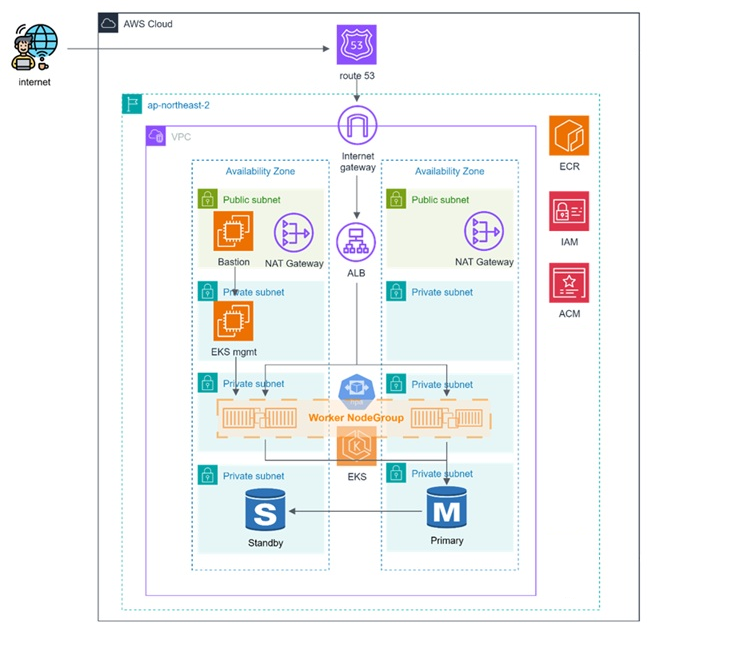

# Kubernetes(EKS)로 배포한 Petclinic

☁️ Petclinic 애플리케이션을 AWS EKS에 배포하고, ALB Ingress / HPA / Karpenter를 적용한 구성의 아카이브입니다.  
학습 및 실습 과정에서 사용한 매니페스트와 디렉토리 구조를 정리했습니다.

---

## 📝 개요

- EKS(eksctl) 클러스터 구성 – 클러스터 엔드포인트 접근: Public + Private, Managed Node Group
- Pod 자격증명(권한 부여) – ALB Controller = IRSA(OIDC), Karpenter = EKS Pod Identity (podIdentityAssociations)
- ALB Ingress Controller(Helm 별도 설치) + ALB에서 TLS 종료(ACM 인증서), Route 53으로 도메인 라우팅
- HPA(CPU 기반) 적용, Karpenter로 노드 자동 확장
- 이미지: ECR, 네임스페이스: web, was

---

## 🏛️ Architecture


구성 요소:
- **EKS(Managed Node Group)**: 관리형 노드 그룹으로 운영 단순화, 재현성 확보
- **ALB Ingress**: HTTPS 종단 및 L7 라우팅
- **HPA**: web/was 각각 CPU 기반 자동 확장
- **Karpenter**: 급격한 부하 시 Node 레벨 자동 확장
- **ECR/RDS**: 컨테이너 이미지 저장소 / 데이터베이스

---

##  Kubernetes 구성
```bash
eks-petclinic/
├─ cluster/
│  └─ eksctl-cluster.yaml        # eksctl로 생성한 EKS 클러스터 정의
│
├─ apps/                         # 애플리케이션 배포 리소스
│  ├─ web/                       # Apache Reverse Proxy
│  │  ├─ web-deployment.yaml     # web Deployment 
│  │  ├─ web-service.yaml        # ClusterIP Service
│  │  ├─ Dockerfile              # Apache + Proxy 설정 이미지
│  │  └─ httpd.conf              # ProxyPass/ProxyPassReverse 설정
│  │
│  └─ was/                       # Tomcat + Petclinic
│     ├─ was-deployment.yaml     # was Deployment 
│     ├─ was-service.yaml        # ClusterIP Service
│     └─ Dockerfile              # Petclinic + Tomcat 이미지
│
├─ ingress/
│  └─ ingress.yaml               # ALB Ingress (ACM 인증서 설정으로 HTTPS 종단)
│
├─ hpa/
│  ├─ hpa-web.yaml               # HPA (web, CPU 기반)
│  └─ hpa-was.yaml               # HPA (was, CPU 기반)
│
├─ karpenter/
│  ├─ ec2-nodeclass.yaml         # Karpenter NodeClass 정의 (EC2 프로비저닝 스펙)
│  └─ nodepool.yaml              # Karpenter NodePool 정의 (스케일링 정책)
```
---

## 📎 참고사항
- 종료된 학습/아카이브용 매니페스트이며, 일부 값(ACM ARN/도메인/ECR 경로 등)은 현재 비활성입니다.
- 구조 참고 및 기록 목적이며, 실제 운영 계정 정보는 포함하지 않습니다.
- **metrics-server**: eksctl 클러스터 정의에서 관리형 Add-on으로 활성화
- **HPA 기준치**: web=60%, was=50% (테스트 목적)
- **이미지 태그**: 현재 :latest 사용 (실습 단순화 목적)

### 관련 레포
- [Terraform 3-Tier 인프라](https://github.com/kjgreen2324/terraform-petclinic)

